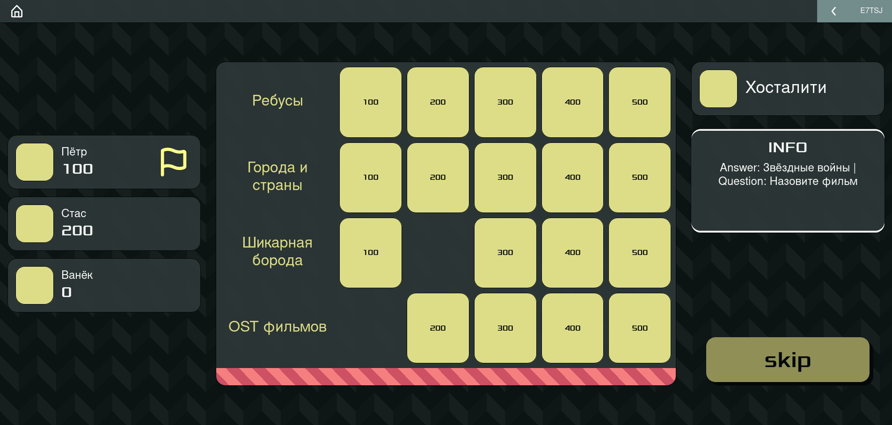
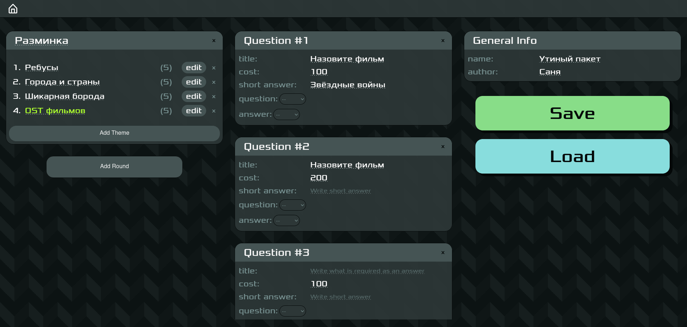

# qua

qua is a game like ["Jeopardy!"](https://en.wikipedia.org/wiki/Jeopardy!), but with a little bit different set of rules, more like ["Своя игра"](https://ru.wikipedia.org/wiki/%D0%A1%D0%B2%D0%BE%D1%8F_%D0%B8%D0%B3%D1%80%D0%B0). But it's a version to play in the web. I made it very hastily for my bachelor thesis.

Now qua is nearly unplayable, and the code is garbage. I intend to make the game properly in the future.

Besides the game, there is a package editor, where you may create packages with questions to play with.

